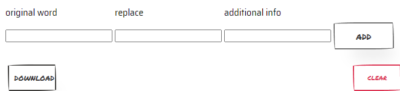

# Lang-Inject

Applications for repetition of studied foreign words.

### How it works?
The user adds words to the dictionary. After that when reading Internet pages, the words in the dictionary are substituted in word on foreign language.

### What dictionaries does this app have?
Users fill in dictionaries themselves.
- 1 dictionary is persistent storage. It is located in file "base.json". This dictionary is downloaded with the application. Information from it can be deleted only by editing the file.

- 2 dictionary is temp storage. This dictionary is populated via the application's popup window. You can clear it with the "clear" button.

### How can i get both dictionaries?
By clicking the "download" button, you will download a json file containing both dictionaries.

### Install
- Go to chrome://extensions/ and check the box for Developer mode in the top right.
- Click on Load Unpacked Extension
- Select the folder with Lang-Inject repository;

### Add words to temp dictionary
- Enter word in you're language at field "original word".
- Enter the word to which it will change  at field "replace".
- (Optional) Enter additional information for a hint. For example, how to pronounce this word.
- Click on "add" button.

#### P.S.
Default version of base.json contains some rus->ja words as example. 
